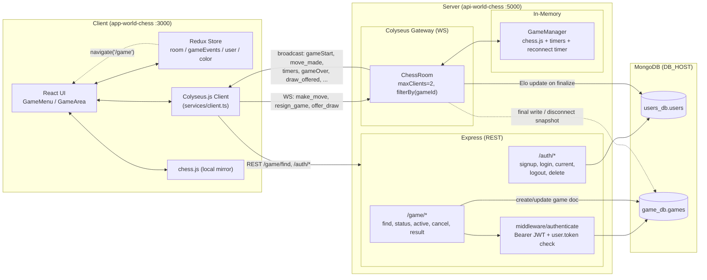
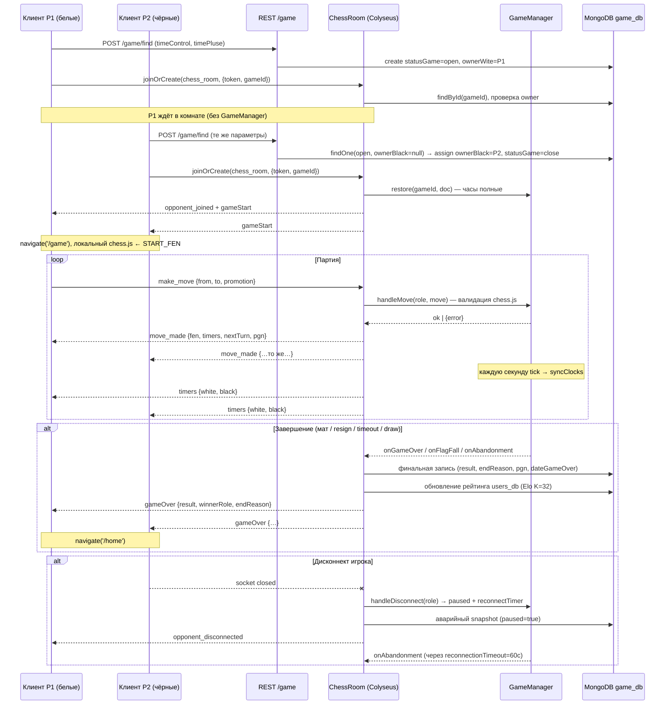

# 2. Схемы и Архитектура Приложения (System Architecture & Tree)

## 2.1 Дерево проекта

```
chess/
├── dev.sh / dev-config.json     # Локальный лаунчер: backend (:5000) → frontend (:3000)
├── docs/                        # Общая документация (этот каталог)
│
├── api-world-chess/             # ── BACKEND ──
│   └── src/
│       ├── server.ts            # Точка входа: HTTP-логирование, монтирование /auth и /game, 404 + error-handlers, listen(PORT)
│       ├── config/
│       │   └── serverConfig.ts  # Express app + http.Server + Colyseus Server(WebSocketTransport) на ОДНОМ порту;
│       │                        #   verifyClient (origin whitelist), define("chess_room").filterBy(["gameId"]), CORS, morgan
│       ├── routers/
│       │   ├── auth.routes.ts   # /auth: signup, login, current, logout, delete (JWT в Authorization: Bearer)
│       │   └── game.routes.ts   # /game: find, status/:gameId, active, cancel, :gameId/result (всё за authenticate)
│       ├── controllers/
│       │   ├── user.ts          # Регистрация (bcrypt 12), логин (JWT 30d, токен пишется в user.token), logout (token="")
│       │   └── game.ts          # Матчмейкинг: createSearchRoom / getGameStatus / cancelSearchRoom / getActiveGame / submitGameResult
│       ├── middleware/
│       │   ├── authenticate.ts  # REST-авторизация: Bearer JWT → verify → сверка user.token (single-session!)
│       │   ├── authenticateWs.ts# Заготовка WS-авторизации (фактически onAuth делает это сам)
│       │   └── userValidation.ts# Joi-схемы signup/login (email .com/.net, password 6..15)
│       ├── models/
│       │   ├── user.ts          # Mongoose-коннект → БД users_db: name, email, password, currentReiting, статистика, token
│       │   └── game.ts          # Mongoose-коннект → БД game_db: игроки, позиция, часы, pgn, moveHistory, result, endReason
│       ├── rooms/
│       │   └── ChessRoom.ts     # Ядро WS-логики: onCreate/onAuth/onJoin/onLeave/onDispose,
│       │                        #   хендлеры make_move/gameMove/resign_game/offer_draw, finalize + Elo, saveGameToDb
│       ├── services/
│       │   ├── GameManager.ts   # In-memory менеджер одной партии: chess.js-движок, часы (tick 1с),
│       │                        #   реконнект-таймер, ничьи/мат/таймаут/сдача, snapshot() для MongoDB
│       │   └── boardConverter.ts# flat-64-строка ↔ FEN; getGameOutcome(); rebuildChessFromHistory()
│       ├── utils/logger.ts      # logError → файловое логирование
│       ├── errors/, responses/  # createError(status, message), дефолтные ответы (частично legacy)
│       └── types/express.d.ts   # Расширение Request (req.user)
│
└── app-world-chess/             # ── FRONTEND ──
    └── src/
        ├── index.tsx            # Bootstrap: Provider(store) + PersistGate + ToastContainer
        ├── app/App.tsx          # Роутинг + глобальные подписки на WS-сообщения комнаты
        │                        #   (gameStart / game / gameOver / move_made / timers / gameResumed / draw_*),
        │                        #   авто-реконнект к активной партии при загрузке
        ├── config/testURL.ts    # BASE_URL (REST) и socketUrl; WS URL захардкожен также в services/client.ts
        ├── services/
        │   ├── client.ts        # new Colyseus.Client("ws://localhost:5000") — единая точка WS-подключения
        │   ├── roomManager.ts   # Синглтон-хранилище активной комнаты (setRoom/getRoom) — вне React-дерева
        │   └── wsMessages.ts    # Фабрики legacy-сообщений (idWs/event...) — частично мёртвый код
        ├── redux/
        │   ├── store.ts         # configureStore + redux-persist (whitelist: token, wsId, theme) + authApi.middleware
        │   ├── api/authApi.ts   # RTK Query: /auth/* + /game/find|cancel|active (Bearer из state.token)
        │   ├── slices/
        │   │   ├── room.ts      # Каноническое состояние активной партии: gameStarted, gameData{idGame, position, часы, ...}
        │   │   ├── gameEvents.ts# Машина статусов idle→searching→playing→gameover; searchGameId; drawOfferedBy
        │   │   ├── user.ts      # userName + stats {rating, gamesPlayed, wins, losses, draws, maxRating}
        │   │   ├── color.ts     # colorGame: "wite" | "black" — мой цвет в текущей партии
        │   │   ├── token.ts     # JWT (persisted)
        │   │   ├── wsID.ts      # legacy-срез (исторический idWs), фактически не используется новой логикой
        │   │   └── theme.ts     # Тема оформления (persisted)
        │   └── thunks/roomThunks.ts # startSearch/cancelSearch (REST) + connectToRoom/resignGame/offerDraw/... (WS)
        ├── features/game/
        │   ├── GameMenu.tsx     # Сетка контролей времени → startSearch → connectToRoom; баннер "уже есть активная игра"
        │   ├── ModalFindGame.tsx# Модалка "Searching for opponent"
        │   └── GameArea.tsx     # Доска + часы: локальный chess.js, оптимистичные ходы, подписки move_made/move_error,
        │                        #   локальный отсчёт 100 мс + жёсткая ресинхронизация по серверным таймерам
        ├── hooks/
        │   └── useCurrentGameNavigation.ts # Кнопка "Current game": GET /game/active → gameStartSuccess → connectToRoom → /game
        ├── helpers/
        │   ├── boardCoords.ts   # boardIndex ↔ клетка a1..h8
        │   ├── theme.ts         # resolvePlayerColor(myName, gameData) → "wite"|"black"; applyTheme
        │   ├── roomSerializer.ts# toGameData() — нормализация WS-сообщений в форму Redux gameData; parseGameOverEvent()
        │   ├── gameTypes.ts     # Типы (GameOverInfo и пр.)
        │   └── showFigure.ts    # Маппинг символа фигуры → ассет
        ├── components/          # UI: Layout, PlayerInfo (блоки игроков + часы + кнопки резин/ничья), Modal, Sidebar, ...
        └── pages/               # LoginPage, RegisterPage, DashboardPage (редирект /game или /home по curentG)
```

## 2.2 Схема логических блоков



## 2.3 Жизненный цикл партии (крупными мазками)



## 2.4 Модель состояний (state machines)

### Redux `gameEvents.status` (клиент)

```
idle ──setSearchMode──▶ searching ──(gameStart WS)──▶ playing ──(gameOver WS)──▶ gameover ──resetGameEvents──▶ idle
  ▲                        │                                                              │
  └────── resetGameEvents ◀┘ (cancel поиска / не удалось подключиться к комнате)          │
  ◀──────────────────────────  (есть также auto-reset при вызове startSearch) ─────────────┘
```

Ключевой маппинг источников истины:

| Данные | Клиент (Redux) | WS-комната (Colyseus state) | In-Memory (GameManager) | MongoDB (`games`) |
|---|---|---|---|---|
| Позиция | `room.gameData.fen` / `position[]` | `state.position`, `state.move` | `chess.js` instance | `position`, `move`, `pgn`, `moveHistory`, `finalFen` |
| Часы (pxт) | `room.gameData.timeWite/timeBlack` + локальный ref-таймер | `state.timeWite/timeBlack` | `timers {white, black}`, tick 1с | `timeWite`, `timeBlack` (снапшот) |
| Статус | `gameEvents.status` | `state.result` (`pending` или финальный), `state.statusGame` | `status` active/paused/finished | `result` + `endReason` |
| Игроки | `gameData.playerWite/playerBlack` | state поля | — | `ownerWite/ownerBlack`, `name*`, `reiting*` |
| Мой цвет | `colorGame` + селектор `selectPlayerColor` | `client.role` ("wite"/"black") | — | `owner*` сравнение |

### ChessRoom / GameManager `status`

```
(комната создана, ждёт P2) → [restore] active ⇄ paused (onLeave/handleReconnect)
                                       │
              ┌── мат/пат/ничьи ───────┼── resign ──┬── timeout (flagFall) ──┬── abandonment
              ▼                        ▼            ▼                        ▼
                          finished → finalizeAndBroadcast → MongoDB + Elo → gm.dispose()
```

## 2.5 Транспортные замечания

- **Один порт — два протокола.** Express и Colyseus делят `http.Server`: HTTP — `/auth`, `/game`; WS — апгрейд Colyseus по тому же :5000. `verifyClient` проверяет `Origin` по whitelist.
- **`filterBy(["gameId"])`.** Colyseus маршрутизирует `joinOrCreate("chess_room", {gameId})` в одну и ту же комнату для одного и того же mongo-`gameId` (roomId Colyseus ≠ gameId; фронт после коннекта диспатчит `connectRoomSuccess({roomId: gameId})` — фактически хранит **mongo id**, см. [07-known-issues.md](./07-known-issues.md)).
- **State комнаты — plain object**, не @colyseus/schema. Синхронизация состояния делается вручную через `broadcast(...)`; сгенерированный Colyseus state-патчинг не используется (room.setState просто обновляет локальный объект, доступный `this.state`).
- **Двойные подписки на клиенте.** Подписки на `move_made`/`move_error` есть и в `App.tsx` (запись в Redux), и в `GameArea.tsx` (локальный движок/часы). Это осознанное разделение зон ответственности, но источник рассинхронизации при забытых зависимостях хуков — см. реестр проблем.
