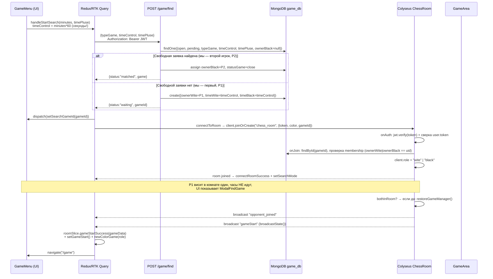

# 3. Логика Поиска Игры и Матчмейкинга (Matchmaking & Queue System)

Матчмейкинг в проекте **гибридный**: заявка создаётся/матчится через **REST**, а «сигнал о находке» и сама партия идут через **WebSocket** (Colyseus-комната). Отдельной очереди (queue) в памяти сервера нет — очередью выступают документы MongoDB со `statusGame: "open"`.

## 3.1 Полный пайплайн от кнопки до старта партии

## 3.2 Передача запроса с клиента (параметры)

Кнопки контроля времени (`GameMenu.tsx → timeControls`) шлют на UI минуты, в сеть — секунды:

| UI-кнопка | `timeControl` (сетевое, сек) | `timePluse` (сек/ход) |
|---|---|---|
| 1min | 60 | 0 |
| 3min | 180 | 0 |
| 5min | 300 | 0 |
| 1min+1s | 60 | 1 |
| 3min+2s | 180 | 2 |
| 5min+3s | 300 | 3 |
| 10min+5s | 600 | 5 |
| 15min+10s | 900 | 10 |
| 30min+30s | 1800 | 30 |
| 30s+1s *(тест)* | 30 | 1 |

`typeGame`: `"standart" | "fisher"`. ⚠️ Режим `fisher` — только ярлык: **доска Fischer Random на сервере не генерируется**, партия всегда стартует со стандартной начальной позиции (см. п. 3.7).

События: на этапе поиска **никаких WS-событий не отправляется** — только REST. WS-подключение (`joinOrCreate`) выполняется уже с известным `gameId`.

## 3.3 Защита и валидация

| Проверка | Реализовано? | Где и как |
|---|---|---|
| **Валидность пользователя (REST)** | ✅ | `middleware/authenticate.ts`: `Bearer`-парсинг, `jwt.verify`, загрузка `User`, сверка `user.token === token` |
| **Валидность пользователя (WS)** | ✅ | `ChessRoom.onAuth()`: тот же JWT + сверка `user.token`; `client.userData` = документ пользователя |
| **Игра с самим собой (две вкладки)** | ❌ **Нет проверки** | Второй `/game/find` от того же `userId` спокойно подхватит собственную открытую заявку и станет `ownerBlack` своей же партии. `onJoin` тоже не сравнивает `ownerWite == ownerBlack` |
| **Уже есть незавершённая игра** | ⚠️ Частично | На фронте — UI-блокировка (`hasActiveGame`) + `WarningBanner`. На бэкенде для `/game/find` проверки на `result:"pending"` у пользователя **нет** — можно иметь параллельно несколько «pending» партий |
| **Совпадение рейтинга (range)** | ❌ **Не реализовано** | Матчинг = точное совпадение `typeGame + timeControl + timePluse` при любом рейтинге. Подпись «Looking for a player with similar rating» в модалке — декорация |
| **Membership в партии при join** | ✅ | `onJoin` сравнивает `uid` с `ownerWite/ownerBlack`, иначе `client.leave(1000)` |
| **Равенство timeControl при матчинге** | ✅ | Ключ поиска — документ с идентичным `timeControl/timePluse/typeGame` |
| **Origin whitelist (WS)** | ✅ | `verifyClient` в `serverConfig.ts` |
| **CORS (REST)** | ✅ | whitelist в dev — любой localhost; в prod — `allowedOrigins` |

> 🚨 **Ошибка проектирования (single-session JWT).** `authenticate` и `onAuth` требуют `user.token === token`. Токен логина **перезаписывает** `user.token`. ⇒ Логин с другого устройства/вкладки мгновенно инвалидирует и REST, и WS-сессию первой вкладки, включая авто-реконнект к идущей партии. Любая «игра с двух устройств» или повторный логин во время партии ломает текущую.

> 🚨 **Неоптимизировано:** матчинг `findOne({...})` выполняется по полям `statusGame, result, typeGame, timeControl, timePluse, ownerBlack` — **индекса в схеме `gameSchema` нет вообще**. На малом трафике незаметно, при росте — full collection scan на каждый `/game/find` и `/game/active` (там запрос по `ownerWite/ownerBlack + result`, тоже без индекса).

> 🚨 **Неоптимизировано (отсутствие атомарности).** `createSearchRoom` делает `findOne` → затем `findByIdAndUpdate`. Два параллельных запроса могут прочитать одну и ту же открытую заявку и **оба назначить себя `ownerBlack`** (race condition). Нужен единый атомарный `findOneAndUpdate({...open, ownerBlack:null}, {$set:{ownerBlack...}})` с проверкой результата, либо транзакция.

> 🚨 **Ошибка (сам-матч).** Поскольку поиск никак не исключает собственные заявки (`ownerWite != userId` не проверяется), пользователь, нажавший «Найти игру» дважды (или с двух вкладок), **матчится сам с собой**: белые=чёрные=один и тот же uid. WS-комната примет оба коннекта, `client.role` перезапишется, дальнейшее поведение непредсказуемо.

## 3.4 Что и когда пишется в MongoDB

| Момент | Запись |
|---|---|
| P1 создал заявку | `GameModel.create({statusGame:"open", ownerWite, nameWite, reitingWite, timeWite=timeControl, timeBlack=timeControl, position:[стартовая flat-строка], move:true, result:"pending"})` |
| P2 заматчился | `findByIdAndUpdate({statusGame:"close", ownerBlack, nameBlack, reitingBlack})` |
| Отмена поиска | `findOneAndDelete` (только пока `open` + `pending`) |
| Дисконнект игрока в партии | `saveGameToDb(paused=true)`: снапшот позиции, истории, `pgn`, остаток часов |
| Финал партии | `saveGameToDb(paused=false, info)`: `result`, `endReason`, `dateGameOver`, `finalFen`, полная история и PGN |

Назначение двойной записи: MongoDB — «холодное» долговременное хранилище + источник для восстановления после рестарта сервера; In-Memory GameManager — «горячее» состояние в течение партии (быстрые тики и валидации без I/O).

## 3.5 Событие «Соперник найден»

Реализовано **не одним**, а двумя последовательными broadcast при входе второго игрока:

1. **`opponent_joined`** `{playerWite, playerBlack}` — у P1 триггерит тост «Суперника знайдено» и `setGameStart()`; у обоих служит UX-сигналом.
2. **`gameStart`** `{idGame, position[], playerWite, playerBlack, reiting*, timeWite/timeBlack, move, typeGame, timeControl, timePluse, fen, lastMoveTimestamp}` — полное состояние для Redux.

`gameId` — это Mongo `_id` заявки, созданной в момент `/game/find`. **Цвета не случайны**: первый заявитель — всегда белые (`ownerWite`), матчер — чёрные.

Если активная игра восстанавливалась после паузы (все были оффлайн), дополнительно шлётся **`gameResumed`** `{timers, fen}`.

## 3.6 Обработка на клиенте

| Шаг | Код |
|---|---|
| Хранение состояния поиска | slice `gameEvents`: `status:"searching"`, `searchGameId`, `searchData {typeGame, timeControl, timePluse}` |
| Приём `gameStart` | `App.tsx → handleGameStart`: `roomSlice.actions.gameStartSuccess(payload)` (`room.gameData`), `setGameStart()` (`status → playing`), `newColorGame(role)` (slice `colorGame`) |
| Определение цвета | `resolvePlayerColor(userName, payload)` — по совпадению ника с `playerWite`/`playerBlack` |
| Редирект | `navigate("/game")` в `handleGameStart`; противоположный редирект на `/home` при `gameOver` |
| Восстановление после F5 | Автоматически в эффекте `App.tsx`: `reconnectToActiveGame` (`GET /game/active`) → те же экшены; также доступно вручную кнопкой «Current game» (`useCurrentGameNavigation`) |

## 3.7 Известные проблемы матчмейкинга

> 🚨 **Рейтинг-диапазон отсутствует** (см. таблицу выше). Matchmaking Rating Range — только в ТЗ, не в коде.

> 🚨 **`fisher` — фиктивный режим.** Переключатель влияет только на ключ матчинга; стартовая позиция — всегда `START_FEN`.

> 🚨 **`searchGameId` живёт только в Redux-tab'е:** при F5 во время ожидания соперника модалка поиска пропадёт, а открытая заявка останется висеть в БД до таймаута по ву (которого нет) либо до ручной отмены с «Current game». Заявки-«сироты» не вычищаются никаким фоном.

> ⚠️ **Неоптимизировано:** «поллинг» `GET /game/status/:gameId` реализован на бэке (`getGameStatus`), но фронт им не пользуется (состояние `pollingInterval` в `gameEvents` — мёртвый код). Это осознанно (WS-signal достаточно), но эндпоинт тянет поддержку.

> ⚠️ **`joinOrCreate` + `filterBy` + `onJoin`:** если между `/game/find` и WS-join прошло много времени и заявку уже отменили, `onJoin` молча выкидывает клиента (`client.leave(1000)`) — фронт показывает только общее «Failed to connect to game room».
