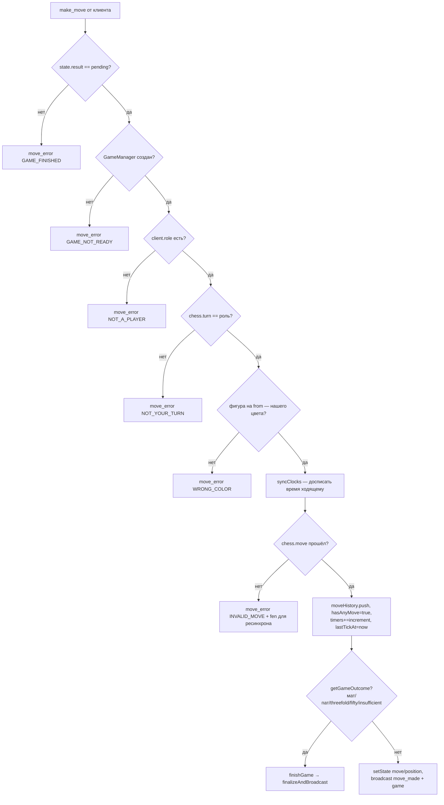

# 5. Логика Хода и Передачи Очереди (Move Logic & Turn Flow)

## 5.1 Инициализация и блокировка доски (клиент)

Ход возможен только когда **все** условия выполнены (слои защиты, от внешнего к внутреннему):

| # | Проверка | Локация |
|---|---|---|
| 1 | `gameEvents.status === "playing"` (не `searching`/`gameover`) | `GameArea.handleClick`: early-return при `isGameOver`; перед отправкой — `gameStatus !== "playing"` → откат к FEN |
| 2 | `isMyTurn`: `chess.turn() === "w"` для белых игрока | Тот же `handleClick` (по локальному зеркалу chess.js) |
| 3 | Легальность: целевая клетка входит в `validMoves` (`chess.moves({square, verbose})`) | `handleClick` |
| 4 | Очерёдность на сервере: `chess.turn()` совпадает с ролью | `GameManager.handleMove` → `NOT_YOUR_TURN` |
| 5 | Цвет фигуры на `from` совпадает с ролью | `GameManager.handleMove` → `WRONG_COLOR` |
| 6 | Легальность на сервере: `chess.move({from,to,promotion})` | `GameManager.handleMove` → `INVALID_MOVE` |

При оптимистичном рендере клиент сначала применяет ход локально (мгновенный отклик), затем шлёт на сервер. Любой отказ приводит к **жёсткому откату** по серверному `fen`.

Промоушн: UI выбора фигуры нет — пешка всегда превращается в ферзя (`autoPromotionSquare` → `"q" `"` по умолчанию в обоих `chess.move`).

## 5.2 Отправка хода

```
Client → room.send("make_move", { from: "e2", to: "e4", promotion?: "q" })
```

Формат — координатный (не SAN). Клетки — `a1..h8`. Клиентский хелпер `boardIndexToSquare` конвертирует индекс 0..63 (0 = a8) в нотацию.

## 5.3 Серверная валидация и передача очереди

`ChessRoom.handleMakeMove` → `GameManager.handleMove(role, move)`:



Полезная нагрузка **`move_made`**:

```json
{
  "move": { "from": "e2", "to": "e4", "promotion": "q" },
  "fen": "rnbqkbnr/pppppppp/8/8/4P3/8/PPPP1PPP/RNBQKBNR b KQkq - 0 1",
  "position": "rnbqkbnrpppppppp88888888888888884P388888PPPP1PPPRNBQKBNR",
  "timers": { "white": 180, "black": 300 },
  "nextTurn": "b",
  "pgn": "1. e4",
  "lastMoveTimestamp": 1760000000000
}
```

Очередь передаётся автоматически самим chess.js (`chess.turn()` после успешного `move` переключается). `GameManager.isWhiteMove` — производное. Параллельно шлётся устаревшее, но используемое клиентом событие **`game`** = `broadcastState()` (полный слепок).

## 5.4 Обработка на клиенте

- **`GameArea`**: `move_made` → `initializeFromFen(fen)` (перерисовка), сброс выделения, `lastMove`-подсветка, мгновенная перезапись `clockRef` из `msg.timers`.
- **`App.tsx`**: `move_made` → запись `fen/move/timeWite/timeBlack` в `room.gameData`, `clearDrawOffer()` (ход снимает предложение ничьей — на сервере следом идёт `draw_cleared`).
- **`move_error`**: тост ошибки + откат к `msg.fen` (иначе к последнему известному `gameData.fen`), сброс выделения.

## 5.5 Разбор бага «Игра уже завершена» при первом ходе

Исторический (сейчас застрахован кодом) сценарий.

**Симптом.** Партия визуально живая (позиция стартовая, оппонент на месте), но первый же ход отклоняется тостом «Гра вже завершена» (`GAME_FINISHED`), иногда — мгновенный `gameOver` по `timeout`.

**Цепочка причин:**

1. В БД мог остаться документ прошлой партии (либо заявка, у которой `timeWite/timeBlack = 0` — см. [04-clock.md](./04-clock.md#44-почему-возникал-баг-0000-при-старте-и-что-сделано), либо `result ≠ "pending"`).
2. Colyseus «воскрешал» комнату по `filterBy(gameId)`: `onCreate` загружал документ, но **`state.result` всегда оставался `"pending"`**, даже когда документ был финализирован.
3. `GameManager.restore()` поднимал мёртвую партию с нулевыми часами; `restoreGameManager` до фикса ещё и получал `idGame = undefined` (читал `this.state.idGame` до `setState`).
4. Первый ход попадал в одну из двух веток:
   - если state был синхронизирован с финальным `result` — отказ `GAME_FINISHED` (ложноположительный с точки зрения пользователя);
   - если часы нулевые — `syncClocks` ронял флаг, `finishGame(timeout)`, затем ход получал `GAME_FINISHED` («Time is over»).

**Что сделано (слои защиты):**

- `onCreate` переносит финальный `result` из БД в `state.result` и **не поднимает** GameManager для завершённой партии;
- часы партии без ходов принудительно полные (на 3 уровнях — см. 4.4);
- `hasAnyMove` запрещает падение флага до первого хода;
- широкое диагностическое логирование `[move] GAME_FINISHED rejected`, `[flagFall]`, `[finalize]`.

> ⚠️ **Остаточный риск.** Пока в `game_db.games` существуют legacy-документы «нулевых часов» **с частичной историей** (ходы были, но часы сбиты), защита `hasAnyMove` не спасёт — восстановление честно поверит снапшоту. Рекомендуется разовая миграция: всем документам с `result:"pending"` пересчитать `timeWite/timeBlack` из `moveHistory`/timestamps либо пометить на ручную проверку.

## 5.6 Legacy-канал `gameMove` — главная дыра валидации

В `ChessRoom` живёт второй хендлер ходов — `gameMove` (формат `{position: string[], move: boolean}` — плоская доска + чей ход). Он существует для «старых клиентов» и **не выполняет никакой шахматной валидации**: позиция просто пишется в state и `GameManager.applyLegacyPosition()` грузит её в движок через `flatToFen`.

> 🚨 **Критическая уязвимость.** Любой клиент комнаты может одним сообщением `gameMove` произвольно переставить доску (включая чужие фигуры и несколько «ходов» за раз). Проверок роли/очереди/легальности нет. Единственное спасение — `flatToFen` не хранит рокировки/en passant и при кривой строке вернёт `null` (но 64-валидация поверхностная).
>
> Дополнительно `applyLegacyPosition` **затирает `moveHistory`** серверной партии (история не восстанавливается из диффа) и оставляет часы тикающими без якоря хода.
>
> **Рекомендация:** удалить хендлер после подтверждения, что в проде нет старых клиентов, либо перевести его вычисление на дифф-детекцию одного хода с полной валидацией через `handleMove`.

## 5.7 Прочие замечания по Move Flow

> ⚠️ **Двойная запись позиции.** После хода state.position хранит **массив из одной** flat-строки (`[flat]`), хотя схема это переживает — исторически `position: Array`. Не критично, но сбивает при отладке.

> ⚠️ **`broadcast("game", ...)` после каждого хода дублирует `move_made`.** Два события несут пересекающиеся данные (position/move/time*). Клиент обрабатывает оба. Избыточный трафик и два пути обновления Redux — кандидат на упрощение протокола.

> ⚠️ **Конфликт нейминга `move`.** В state/БД `move: boolean` = «сейчас ходят белые», а в `move_made` `move` = объект хода `{from,to}`. На клиенте это регулярно требует кастов-осторожностей; в долгую — переименовать в `whiteToMove` / `lastMove`.

> ⚠️ **Отсутствие дедупликации ходов.** При сетевом дубле повторный `make_move` от того же клиента после уже принятого хода упадёт с `NOT_YOUR_TURN` — корректно, но клиент не различает «дубль отклонён» от реальной ошибки (оба → тост). Через idempotency-key можно было бы отвечать снэпшотом без тоста.
